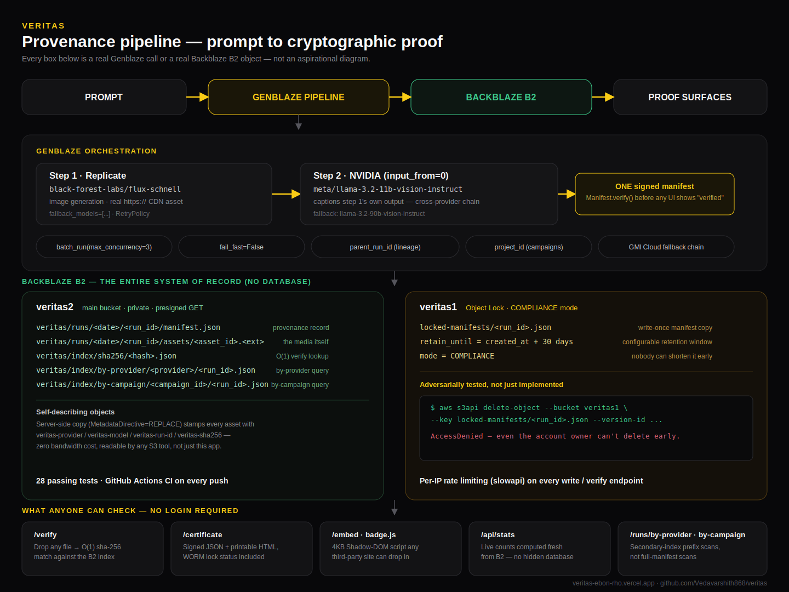

# Veritas — provenance-first generative media studio

**Live app:** https://veritas-ebon-rho.vercel.app · **Backend:** https://veritas-backend-9iwa.onrender.com/api/health · **Demo video:** https://youtu.be/6JzY13M0j5g · **CI:** 

Every AI-generated image ships with a **cryptographically verifiable provenance
manifest** stored on **Backblaze B2** — bound to the exact image bytes it
describes. Anyone can drop any file into the public `/verify` page and get an
instant O(1) answer: was this generated through Veritas, and if so, by what
model, from what prompt, on what date. Modify a single bit and the match
breaks.

Built for the **Backblaze Generative Media Hackathon** (Genblaze + B2).

> **Note on the free-tier backend:** Render's free tier spins the API down
> after 15 min idle. The first request after a nap can take 30-60s to wake
> the container. Subsequent requests are fast.

---

## What it does

Every arrow below is a real Genblaze call or a real Backblaze B2 object — not
an aspirational diagram:



Walking through every feature, in the order you'd actually hit them in the app:

- **Generate (Single mode).** Describe an asset, pick a modality, hit
  Generate. A real two-step Genblaze pipeline runs: Replicate's
  `flux-schnell` produces the image, then NVIDIA's
  `llama-3.2-11b-vision-instruct` captions it — both steps signed into one
  manifest and uploaded to B2. The "Verified" badge only appears after
  `Manifest.verify()` actually passes; it's a cryptographic check, not a UI
  flag.
- **Campaigns.** Switch to Campaign mode, write one brief and 2-12 variant
  prompts, hit Generate campaign. Genblaze's `Pipeline.batch_run` fans them
  out as one real concurrent batch (bounded concurrency, per-variant failure
  isolation) — not a loop calling generate N times. Every variant gets its
  own manifest, grouped under a shared `campaign_id`.
- **Campaigns section.** A dedicated view below the gallery lists every
  distinct campaign as its own card — brief, variant count, verified count,
  a stacked thumbnail preview. Click one to open every variant it produced
  in a single grid; click a variant to open its full provenance modal.
- **Generated Assets gallery.** A bento-style grid of everything ever
  generated, with corner tags: **Verified** (passed the cryptographic
  check), **Campaign** (part of a batch), **Iteration** (a regenerate of an
  earlier asset).
- **Provenance modal.** Click any card for the full record: provider/model,
  sha-256 (copyable), run id, campaign id, exact B2 storage path, the
  AI-generated caption (when the multi-step chain ran), a raw manifest JSON
  toggle, and a **Certificate** link.
- **Regenerate, with lineage.** "Regenerate (linked)" creates a new run that
  records `parent_run_id` pointing at the one it came from. The modal
  renders the full iteration chain, so an asset's entire edit history is
  auditable, not just its latest state.
- **`/verify` — public, no login.** Drop any file and its sha-256 is checked
  against B2 in O(1) time (a purpose-built hash index, not a manifest scan).
  A match returns full provenance metadata; a miss says so plainly. Change
  one pixel and a real match breaks.
- **`/certificate` — a portable proof.** One click generates a signed
  provenance certificate: prompt, hash, storage location, WORM lock status
  if applicable. Printable to PDF via the browser, or downloadable as raw
  JSON — for legal/editorial workflows that need proof outside the app.
- **`/embed` + `badge.js` — infrastructure other sites can use.** A 4KB
  Shadow-DOM'd `<script>` any third-party site can drop next to an image;
  it live-checks the asset's hash against Veritas over one HTTPS request,
  no login, no SDK. `/embed` doubles as a live sandbox to try it against a
  real generated asset before copying the snippet.
- **System of Record dashboard.** Six tiles on the homepage — manifests,
  assets (+ total size), the verify-index, secondary indexes, WORM-locked
  copies, multi-step runs — computed fresh from B2 on every request. No
  cache table, no separate database, ever.
- **WORM / Object Lock bucket.** Every manifest also gets a write-once copy
  in a second, Object-Lock-enabled B2 bucket in COMPLIANCE mode. This was
  adversarially tested, not just implemented: an explicit-version
  `DeleteObject` on a locked manifest returns `AccessDenied` — not even the
  account owner can quietly edit history.

---

## The four judging criteria — how each is answered

### 1 · Real-world utility
- **Public `/verify` needs no login.** Anyone hosting an AI-generated asset can point their audience at it.
- **Embeddable "Verified by Veritas" badge widget** ([`/embed`](https://veritas-ebon-rho.vercel.app/embed)) — a 4KB Shadow-DOM'd script third-party sites drop next to any AI image; one HTTPS request, live check. Turns Veritas from a standalone tool into infrastructure.
- **Downloadable provenance certificate** — printable one-page HTML per asset (or raw JSON), for legal / editorial / compliance workflows.
- **Iteration lineage** (`parent_run_id`) — regenerate any asset and the new version links back to the one it came from. Editorial revision history is auditable, not just latest state.
- **Campaigns** — one brief → 2-12 provable variants, each with its own manifest, grouped under a shared `campaign_id`.

### 2 · Production readiness
- **Deployed live**, not localhost-only. Frontend on Vercel (auto-deploy on push), backend on Render from a `render.yaml` Blueprint.
- **Per-IP rate limiting** (`slowapi`) on paid endpoints — `/api/generate` 10/hr, `/api/campaign` 3/hr, `/api/verify*` 60/hr. Configurable via env vars.
- **Adversarial retry policy** — `RetryPolicy.aggressive()` on NVIDIA providers so transient 500s / timeouts from their free-tier endpoint don't sink a real user's request.
- **CI on every push** — 28-test pytest suite + `tsc --noEmit` + `next build`. Real bugs caught by tests during development (see the git history).
- **Adversarially tested WORM** — the compliance-mode Object Lock claim was verified by attempting an explicit-version `DeleteObject` on a real locked manifest: `AccessDenied`. Not a claim, a passed adversarial check.
- **Credentials** — keys were rotated before the repo went public; `.env` is git-ignored; B2 keys are bucket-scoped, not the master key; CORS is deliberate wildcard (badge use case) but every write endpoint is rate-limited.

### 3 · B2 storage + orchestration
**Zero separate database.** B2 objects *are* the entire system of record — every counter on the deployed [`/api/stats`](https://veritas-backend-9iwa.onrender.com/api/stats) endpoint is computed by listing B2 objects live:

```
veritas/runs/<date>/<run_id>/manifest.json           # Genblaze provenance record
veritas/runs/<date>/<run_id>/assets/<asset_id>.<ext> # the media
veritas/index/sha256/<hash>.json                     # O(1) verify lookup
veritas/index/by-provider/<provider>/<run_id>.json   # secondary index
veritas/index/by-campaign/<campaign_id>/<run_id>.json# secondary index
```

Plus a **second bucket with Object Lock enabled** (`veritas-genmedia-locked`) that holds WORM copies of every manifest in COMPLIANCE mode — undeletable even by the account owner until the retention window expires.

Additional B2-native touches:
- **Server-side asset metadata stamping** via S3 `copy_object` with `MetadataDirective=REPLACE` — provider/model/run-id/sha256 attached as B2 object metadata headers, zero bandwidth, readable by any S3 tool.
- **Presigned URLs only** — the bucket is private; the frontend serves every image through a time-limited presigned GET.
- **Live queryable-B2 endpoints** — `/api/runs/by-provider?provider=...` and `/api/runs/by-campaign?campaign_id=...` do O(list) prefix scans against the secondary indexes instead of manifest full-scans.

### 4 · Use of Genblaze
- **Multi-step, cross-provider pipeline** — every image generation is a chained `Pipeline.step(image_provider).step(chat_provider, input_from=0)`. Replicate's `flux-schnell` produces the image, NVIDIA's `meta/llama-3.2-11b-vision-instruct` (a separate NIM endpoint, different vendor entirely) captions it, and **both steps are signed into the same manifest** so the AI-generated description is cryptographically bound to the exact image bytes — even though two independent vendors made it.
- **Real fallback chains** on every real-provider path (`fallback_models=[...]`) — GMI image: seedream-4-0 → seedream-3-0; GMI video: pixverse-v5.6-t2v → wan2.6-r2v; NVIDIA vision: llama-3.2-11b → 90b.
- **Real batch orchestration** for campaigns — `Pipeline.batch_run(prompts=[...], max_concurrency=3, fail_fast=False)`. Not a for-loop wearing a batch costume; genuine concurrent Genblaze runs with per-variant failure isolation.
- **Manifest.verify() is the source of truth** — the "verified" badge in the UI reflects a passed cryptographic check that runs *inside* the pipeline, not a status flag we set ourselves.
- **Genblaze's own lineage primitives** — `parent_run_id` (iterations) and `project_id` (campaigns) are used natively, not shadowed by a custom system.

### Provider auto-routing
The pipeline auto-selects the provider per modality. Set the corresponding key
and the path activates:

| Modality | Live path (this deploy)                                    | Auto-fallbacks (activate on key)                 |
|----------|-------------------------------------------------------------|--------------------------------------------------|
| Image    | Replicate `flux-schnell` + NVIDIA `llama-3.2-11b` caption   | NVIDIA `flux.1-dev` (own two-step) → GMI Cloud `seedream-4-0` → `seedream-3-0` |
| Video    | (none — image demo)         | GMI Cloud `pixverse-v5.6-t2v` → `wan2.6-r2v`     |
| Audio    | (none — image demo)         | ElevenLabs `eleven_flash_v2_5` → `turbo_v2_5`    |

`VERITAS_PROVIDER=mock` in `.env` short-circuits to a local placeholder that runs the full B2 + manifest loop with zero API cost — used for demos and CI.

---

## Stack

- **Backend:** Python 3.12 · FastAPI · Genblaze `0.4.1` (`genblaze[all]` + provider plugins) · boto3 (S3-compatible B2) · slowapi (rate limiting) · pytest.
- **Frontend:** Next.js 16 · React 19 · TypeScript · Tailwind CSS · shadcn/ui (base-ui) · Framer Motion.
- **Deploy:** Vercel (frontend, auto) · Render (backend from `render.yaml`).
- **CI:** GitHub Actions — pytest + typecheck + build on every push.

## Setup

```bash
# 1. Python 3.12 venv
py -3.12 -m venv backend/.venv
backend/.venv/Scripts/python -m pip install -r backend/requirements.txt

# 2. Configure secrets
cp backend/.env.example backend/.env    # then fill in B2 keys + NVIDIA_API_KEY

# 3. Validate B2 + Genblaze end-to-end
backend/.venv/Scripts/python backend/scripts/smoke_b2.py
backend/.venv/Scripts/python backend/scripts/smoke_pipeline.py

# 4. Run the backend
cd backend && .venv/Scripts/python -m uvicorn app.main:app --port 8000

# 5. Run the studio (another terminal)
cd frontend && npm install && npm run dev   # http://localhost:3000

# 6. Run the tests
backend/.venv/Scripts/python -m pytest backend/tests -v
```

The frontend proxies `/api/*` to the backend; override the target with
`BACKEND_URL` in `frontend/.env.local` if the backend isn't on `:8000`.

## API surface

| Method  | Path                              | Purpose                                                        |
|---------|-----------------------------------|----------------------------------------------------------------|
| GET     | `/api/health`                     | Liveness + active provider mode                                |
| POST    | `/api/generate`                   | Run the provenance pipeline (rate-limited 10/hr per IP)        |
| POST    | `/api/campaign`                   | Fan out N provable variants (rate-limited 3/hr per IP)         |
| GET     | `/api/runs`                       | List recent generations from B2 manifests                      |
| GET     | `/api/runs/by-provider?provider=` | O(list) prefix scan via secondary index                        |
| GET     | `/api/runs/by-campaign?campaign_id=` | O(list) prefix scan via secondary index                     |
| GET     | `/api/stats`                      | Live B2 metrics (no separate DB, no cache store)               |
| GET     | `/api/manifest?key=`              | Fetch a full provenance manifest                               |
| GET     | `/api/asset-url?key=`             | Presigned GET URL for a private asset                          |
| GET     | `/api/certificate?key=`           | Signed provenance certificate JSON (`?download=true` for save) |
| POST    | `/api/verify`                     | Upload a file → is it authentic? (rate-limited 60/hr per IP)   |
| POST    | `/api/verify-hash`                | Check a sha256 against known provenance                        |
| GET     | `/docs`                           | Auto-generated OpenAPI docs                                    |

## Deployment

- **Frontend:** Vercel — `BACKEND_URL` env var points `/api/*` at the Render backend.
- **Backend:** Render Blueprint from `render.yaml`. Secrets injected via the Render dashboard, never committed.
- **CORS:** globally `*` because the [embeddable badge](https://veritas-ebon-rho.vercel.app/embed) is designed to work on any third-party site. Every expensive endpoint is per-IP rate-limited, so wildcard CORS isn't an abuse vector.

## Security posture

- `backend/.env` is git-ignored; keys have been rotated since first exposure.
- B2 application keys are **bucket-scoped**, not the master key. Two independent keys — one for the main bucket, one for the WORM-locked bucket.
- Public bucket access is disabled; every media URL served to the browser is a time-limited presigned GET.
- Rate limits are the abuse ceiling on paid-API endpoints, not just the retry ceiling.
- WORM lock **adversarially tested** — a direct `DeleteObject` on a locked manifest version returns `AccessDenied`.
